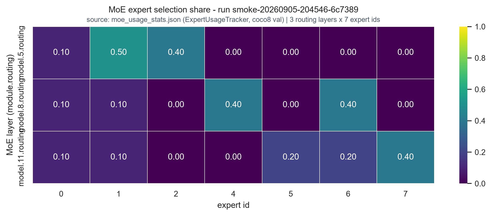
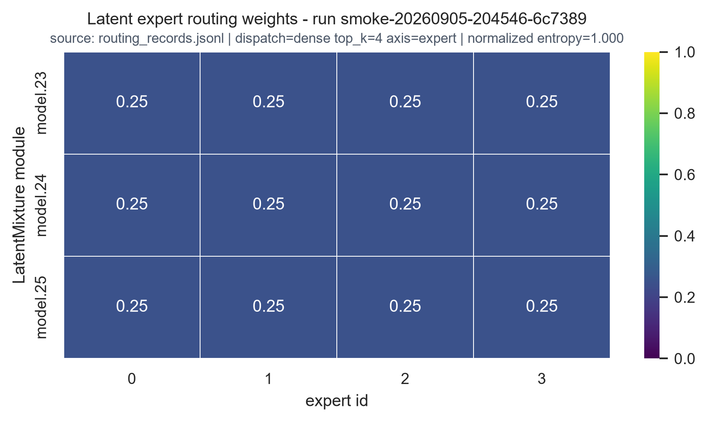

# E3 路由透视镜：三族准入 Smoke（MoT / MoE / Latent）

Owner：刘欣燃（GitHub：`Aliferous-spec`）

状态：**P0-6 最终验收 PASS（2026-09-05）**，与 `docs/p0-acceptance.md` 一致（P0-1..P0-6 全部 PASS）；**P1-A 逐样本采集 closure PASS（2026-09-07）**，见 `docs/p1-a-closure.md`；P1-B 逐样本开销测量已实现并通过验收（2026-09-09），见下「P1-B 逐样本开销测量」；P1 真实训练减速补充测量已执行（2026-09-10，非验收依据），见下「P1 真实训练减速测量」。

本仓库是 E3 准入审核包：在已部署的 YOLO-Master 上，以非侵入 forward hook / 原生快照属性对 MoT、MoE、Latent 三类路由各采集一次 routing 快照，提供结构化日志、CSV/JSONL/PNG 证据、字段字典、开销测量结果与风险降级。没有修改 YOLO-Master 核心 `forward`；没有为本 E3 观测链路提交上游代码 PR。另有独立的 Windows CPU 推理文档贡献已通过 `Tencent/YOLO-Master#132` 合并（关闭 Issue `#119`）。

## 交付清单对照

| 准入项 | 材料 |
| --- | --- |
| 环境安装 | `artifacts/smoke/admission-20260825/environment.json`；9.5 验收 run 快照见 `artifacts/smoke/smoke-20260905-204546-6c7389/environment.json` |
| 基线与范围 | README「版本与边界」+ `docs/requirements.md` |
| 复现 | `run_smoke.cmd`（采集）/ `run_tests.cmd`（单测） |
| 配置文件 | `configs/e3_smoke.yaml` 与 `artifacts/.../config.resolved.yaml` |
| 完整日志 | `artifacts/smoke/smoke-20260905-204546-6c7389/full.log`（8.25 归档：`artifacts/smoke/admission-20260825/full.log`） |
| 结果证据 | `artifacts/smoke/smoke-20260905-204546-6c7389/`（13 项）：`summary.json`、`routing_records.jsonl`、`mot_routing_*.csv`、`mot_expert_heatmap_top1_share.png`、`moe_usage_stats.json`、`latent_snapshot.jsonl`、`overhead_result.json`、`manifest.sha256.json` |
| 最终验收 | `docs/p0-acceptance.md`（P0-6，2026-09-05，逐项 PASS） |
| 字段字典 | `docs/smoke-design-and-schema.md` |
| 开销与降级 | `docs/overhead-and-risk-plan.md` |
| MoE 温度探针（补充证据，untrained routing-only） | `docs/moe-temperature-probe.md` |

## 一键复现

本仓库与已部署的 `YOLO-Master` 目录同级。在 Windows CMD 中执行：

```bat
cd /d "C:\path\to\YOLO-Master-E3-Admission"
set BASELINE_PY=C:\path\YOLO-Master\.venv\Scripts\python.exe
run_smoke.cmd
```

单元测试：

```bat
run_tests.cmd
```

脚本自动使用部署环境；首次运行若本地没有 coco8，会下载约 433 KB 数据。也可以直接传 `--baseline-root` 或设置 `BASELINE_ROOT` 环境变量指定 YOLO-Master 路径。

## 实测结果（2026-08-25 本机复跑）

- **MoT**：官方合成脚本，4 类场景（dense_small / large_regular / irregular_occluded / sparse_small）× 3 专家，输出 `mot_routing_detailed.csv` / `mot_routing_scenarios.csv` / `mot_deformable_activation_check.csv` / `mot_expert_heatmap_top1_share.png`。
- **MoE**：`ExpertUsageTracker` 在 coco8 真实验证集（4 张图）上对 `model.5/8/11.routing` 三个 router 成功采集 hits / weighted_sum。
- **Latent**：`model.23/24/25` 三个 LatentMixture 模块输出非空 `last_routing_snapshot`，字段数约 35-36。
- **开销**：yolo-master-n @ 640×640，50 次前向，on/off 对照实测 1.50%~2.55%（运行间有波动，以 `overhead_result.json` 为准），满足 < 10% 目标。
- **已知基线现象**：随机初始化模型在全部 4 类合成场景下 `LocalConvTransformer` 专家 `top1_share` 恒为 1.00（专家坍塌），属训练前基线真实特征，不用于判断训练后质量。


## P0 最终验收（2026-09-05）

- 验收记录：`docs/p0-acceptance.md`；验收 run_id：`smoke-20260905-204546-6c7389`；产物目录：`artifacts/smoke/smoke-20260905-204546-6c7389/`。
- 产物完整性：13 个文件，`manifest.sha256.json` 覆盖 12 项（自排除自身），SHA-256 复核 12/12 一致。
- 验收命令：`python.exe scripts\run_e3_smoke.py --config configs\e3_smoke.yaml --baseline-root D:\YOLO-Master`；exit 0，`full.log` 以 `result=PASS` 结束，四 step（mot/moe/latent/overhead）均 PASS。
- 单元测试：`python -m pytest tests -q` → `56 passed`，exit 0。
- `routing_records.jsonl`：15 行 v1 记录（行级 `schema_version == "e3-routing/v1"`），MoT 9 + MoE 3 + Latent 3，均为真实 forward 后自动发现并采集（见 p0-acceptance §2.4/§2.5）。
- 开销（验收跑）：`21.75%`（同日首跑 `-9.44%`，hook 开关时间差波动）；P0 只验证带符号解析与有限值，不做 `<10%` 阈值判定（见 p0-acceptance §4）。

### P0 静态图补全（MoE / Latent）

MoT 静态图由上游脚本产出（见上「实测结果」）；MoE / Latent 两张图由 `scripts/render_family_figures.py` 读取本验收 run 的既有证据（`moe_usage_stats.json` / `routing_records.jsonl`）渲染——不改上游、不重采、不动 MoT 图。逐图来源 run、模块、专家与 SHA-256 见 `artifacts/figures/p0/figures.json`。





## P1-A 逐样本采集 Closure（2026-09-07）

- Closure 记录：`docs/p1-a-closure.md`；正式 run_id：`smoke-20260907-002319-d05c10`；产物目录：`artifacts/smoke/smoke-20260907-002319-d05c10/`（14 个文件）。
- P0 regression：无。P0 四 step（mot/moe/latent/overhead）均 PASS；canonical `routing_records.jsonl` 15 行、全 `step=None`，语义与 P0 一致。
- P1-A sample：`sample_routing_records.jsonl` 51 行（mot 4x9 + moe 4x3 + latent 1x3），全行 `e3-routing/v1`、run_id 一致、per-family step 连续、主键无重复、canonical 未混入 sample rows。
- manifest/verify：manifest 13 项 SHA-256 13/13 一致；`--verify-artifacts` → `result=PASS`（exit 0）。
- 质量门：pytest `68 passed`；ruff（本次涉及文件）`All checks passed!`。
- P1-B（逐样本开销测量）：本 closure 未做 overhead 实验（P1-B 于 2026-09-09 独立实现并验收，见下）。

## P1-B 逐样本开销测量（2026-09-09）

- 实现：`scripts/measure_sample_capture_overhead.py` 与 runner 的 `sample_overhead` step；被测对象为 P1-A 逐样本采集链路（MoE yolo-master-n @ 640x640 CPU），产物 `sample_overhead_result.json` 独立于 canonical / sample JSONL。
- 协议：iteration-level 交替配对——每对 = 1 次 OFF forward + 1 次 ON 采集 cycle，OFF→ON 相邻计时，抑制旧逐块协议（先连跑 50 次 OFF 再 50 次 ON）混入的慢漂移；warmup=5、120 paired observations（>= 100）；ON 臂含 BN running-state 恢复与 snapshot force，JSONL 写盘不计入。spec（`docs/p1-spec.md` §7）未定义 ABBA 参数，故采用单一 OFF→ON 顺序，并在 artifact 的 `protocol.pairing` 中记录该限制。
- 统计：per-pair `overhead_percent`（mean ± std、median、P95、min/max、n）与 `paired_difference_ms`；mean overhead 的 percentile bootstrap 95% CI（10000 resamples、固定 seed）。artifact 记录 protocol / parameters / sample_workload / 环境 / 时间戳 / baseline 三元组。
- 验收 run_id：`smoke-20260909-003356-2960be`；产物目录 `artifacts/smoke/smoke-20260909-003356-2960be/`（15 文件，manifest 覆盖 14 项）。`--verify-artifacts` → `result=PASS`；canonical `routing_records.jsonl` 仍为 15 行、`sample_routing_records.jsonl` 仍为 51 行；pytest `90 passed`。
- 本次实测统计事实（只报告测量，不做 `<10%` 或性能结论，数值含运行噪声，以 artifact 原始数据为准）：overhead% mean 3.11（95% CI [0.51, 6.68]）、median 1.99、P95 14.18、min -37.27 / max 148.66、n=120；paired difference ms mean 6.31（median 3.99、P95 44.75）。

## P1 真实训练减速测量（补充测量，非验收依据）

- 结果入口：`docs/p1-training-slowdown-result.md`；预注册判据 `docs/p1-judging-criteria.md`；artifact `artifacts/training_slowdown/train-slowdown-20260911/slowdown_result.json`。
- 实测（seed 0/1/2，ABBA 块级配对 n=6）：配对 slowdown mean **−5.38%**，bootstrap 95% CI **[−15.93%, +6.12%]**；按预注册判据「CI 上界 < 10%」判定 **PASS**（上界 +6.12%）。
- CI 跨 0，故不能据此声称观测链会加速训练。`docs/requirements.md` §2 与 `docs/p1-spec.md` §10 已把「训练减速 <10% 的正式结论」列入不做清单，本结果**不作为验收依据**，仅如实披露。
- baseline_root：`D:\YOLO-Master` @ `aa5d2e20c109b96f4a0c68f667ed2694586ef745`；权重产物 `runs/seed*/weights/*.pt` 不纳入 Git（仅本地）。

## 版本与边界

- 官方锁定基线（`configs/e3_smoke.yaml` 的 `official_base_ref` 记录值）：`3eb6cd914b651a06e2cd08ea87d12c28cab95502`（2026-08-23，main 分支）。
- schema_version：当前实际为 `e3-routing/v1`（`routing_records.jsonl` 每条记录均为该值，验收见 `docs/p0-acceptance.md` §2.5）。8.25 admission 与 9.5 验收 run 的 `summary.json` / `config.resolved.yaml` 顶层遗留 `e3-routing-smoke/v0.1-candidate` 属历史证据，不重写；`configs/e3_smoke.yaml` 已同步为 `e3-routing/v1`。
- 本次验收实际运行基线与锁定 ref **不一致**，如实记录、不伪装成同一基线：
  - 运行时 `ultralytics` 包来自 venv editable install：`D:\Claude_Workspace\projects\YOLO-Master-review`，HEAD `d604c4bca8ceba3240c730f1b6e2767b7a320f6c`（工作树含未提交改动）；
  - smoke `baseline_root`（chdir 目标 / harness 脚本 / model config 来源）：`D:\YOLO-Master`，HEAD `aa5d2e20c109b96f4a0c68f667ed2694586ef745`；
  - **editable 环境 HEAD 与 baseline HEAD 是两个不同 checkout，不可视为同一个 commit**：`d604c4bca8ceba3240c730f1b6e2767b7a320f6c` ≠ `aa5d2e20c109b96f4a0c68f667ed2694586ef745`；training slowdown 正式运行改以 `PYTHONPATH=D:/YOLO-Master` 解析到 baseline checkout（见 `docs/p1-training-slowdown-result.md` §1），与本节 smoke 的 editable 环境不同。
  - 原因：验收在已部署的本地 checkout 上执行，review 与部署目录相对官方锁定 ref 各有演进与本地改动；该差异按环境实况记录（同 `docs/p0-acceptance.md` §4），不代表三处代码等价。
- 已覆盖 MoT / MoE / Latent 三族；实时面板、token 原图热图与正式统一 schema 冻结属于后续阶段（P1-A 已于 2026-09-07 closure，见 `docs/p1-a-closure.md`；P1-B 已于 2026-09-09 验收，见上「P1-B 逐样本开销测量」）。
- 已知实现耦合：MoE 采集依赖上游模块私有属性 `_moe_force_snapshot`，详见 `docs/smoke-design-and-schema.md` §7。
